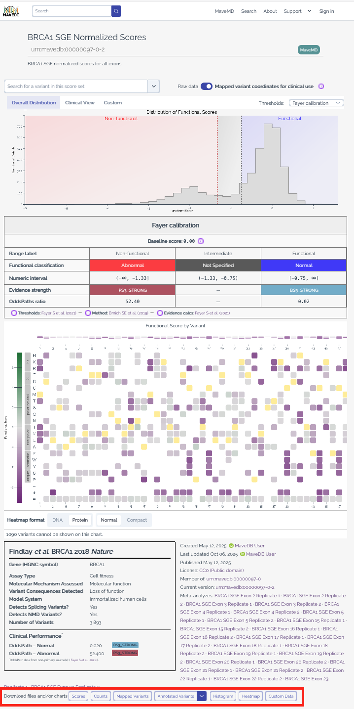

# Downloading Data

MaveDB provides several ways to download variant effect data, from individual dataset downloads to bulk archive downloads. This page describes the available download methods and output formats.

## Individual dataset downloads

Each [score set](../getting-started/key-concepts.md#score-sets) page in MaveDB includes download options for the data associated with that record. You can access these by navigating to a score set page and using the download controls.

<figure markdown="span">
  
  <figcaption>Download options available on a score set page, including score/count CSV, mapped variants JSON, and annotated variant exports.</figcaption>
</figure>

### Score and count data

MaveDB allows users to download variant effect score data along with associated count data in **CSV** (Comma-Separated Values) format.

The downloaded file contains the same data that was uploaded by the submitter, with an additional column for variant [URNs](../reference/accession-numbers.md) that uniquely identify each variant in MaveDB. Users may also choose to include other MaveDB-generated columns in this output, such as mapped variant HGVS strings and VRS identifiers, if available.

!!! warning
    Score and count columns are non-prescriptive and may vary between datasets. Columns may mean different things between datasets, so users should refer to the dataset methods section for details on the specific columns included in each download.

### Mapped variants (VRS JSON)

MaveDB stores [mapped variants](../reference/variant-mapping.md) using the [GA4GH VRS](https://vrs.ga4gh.org/) standard for representing genetic variants. For datasets that have been mapped, users may download a JSON file containing all mapped variants associated with the score set. This provides a structured representation of each variant including genomic coordinates, alleles, and reference sequences.

### Annotated variants (VA-Spec)

MaveDB provides annotated variant data in the [VA-Spec](https://va-spec.ga4gh.org/) format, which builds upon the VRS standard to include additional annotations relevant to variant interpretation. This output includes functional classifications, evidence strengths, and other metadata associated with each variant.

There are three types of VA-Spec objects that MaveDB can provide. Functional Impact Study Results are available for all mapped score sets, while Functional Impact Statements and Variant Pathogenicity Statements additionally require [score calibrations](../reference/score-calibrations.md). Each object type builds on the previous, from raw experimental results to clinical-grade pathogenicity evidence. For detailed descriptions of each object type, example JSON, and notes on how MaveDB data maps into these standards, see the [Data Standards](../reference/data-standards.md) reference page.

## Bulk downloads via Zenodo

A complete set of MaveDB data and metadata is available as a bulk download hosted on [Zenodo](https://zenodo.org/).

!!! note
    The DOI [10.5281/zenodo.11201736](https://doi.org/10.5281/zenodo.11201736) always resolves to the most recent version of the archive. The archive is updated quarterly.

### Archive contents

The archive contains:

- A single JSON document called `main.json` that provides the structured metadata for every [experiment set, experiment, and score set](../getting-started/key-concepts.md).
- Score set data in `.csv` format, with separate score and count files for each record as appropriate. Each file is named using the score set URN.

### Who should use bulk downloads?

Users who need to download a large number of MaveDB datasets are strongly encouraged to use and cite these archival releases, particularly for machine learning or AI-based studies where the associated data needs to be clearly identified for reproducibility. 

For users who only need a small number of datasets, we recommend downloading directly from the score set pages or via the API to ensure you have the most up-to-date data and metadata for each record.

!!! info
    Only datasets released using the [CC0](https://creativecommons.org/public-domain/cc0/) public domain license are included in the archive, and CC0 is the license applied to the archive itself. Datasets provided by MaveDB under other licenses (CC BY 4.0 or CC BY-SA 4.0) are not currently included in the bulk download.

## See also

- [Data standards](../reference/data-standards.md) -- detailed descriptions of VRS and VA-Spec object types with examples.
- [Variant mapping](../reference/variant-mapping.md) -- how MaveDB maps variants to genomic coordinates for the VRS JSON format.
- [Score calibrations](../reference/score-calibrations.md) -- understand calibration data that powers functional classifications in VA-Spec exports.
- [Data formats](../submitting-data/data-formats.md) -- details on the MAVE-HGVS notation and score/count table formats.
- [API quickstart](../programmatic-access/api-quickstart.md) -- retrieve datasets programmatically instead of downloading manually.
- [Searching datasets](searching.md) -- find the datasets you want to download.
