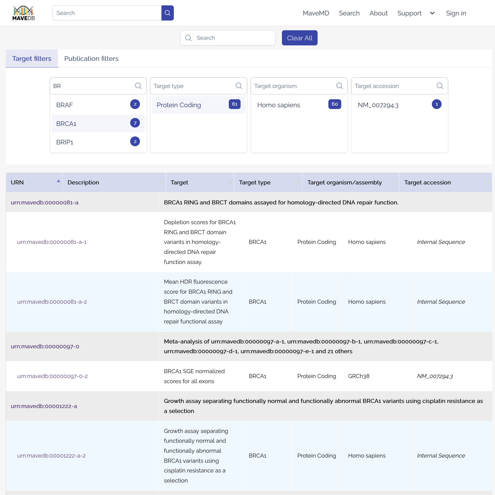

# Dataset search

MaveDB provides a search interface to help users find relevant datasets. You can access the search page by clicking on the **Search** link in the top navigation bar.

!!! tip "Dataset search vs. MaveMD search"
    The **dataset search** described on this page finds experiments and score sets by target, publication, or keywords — use it when you want to explore what MAVE data is available for a gene or topic. To look up functional evidence for a **specific variant**, use [MaveMD](../mavemd/index.md) instead, which searches across all datasets at the variant level and provides context useful for clinical interpretation.

## Search interface

<figure markdown="span">
  
  <figcaption>The MaveDB search interface with target filters and keyword search. Results are grouped by experiment, with matching score sets listed underneath.</figcaption>
</figure>

The search interface allows users to filter datasets based on various criteria.

In the **Target** tab, users can filter datasets by the following fields drawn from user-submitted [target](../submitting-data/targets.md) metadata:

- **Target name** -- The name of the target associated with the dataset (usually a gene or protein).
- **Target type** -- The type of target (e.g., protein-coding gene, non-coding RNA, regulatory element).
- **Organism** -- The organism from which the target is derived.
- **Target accession** -- The accession number or identifier for the target (e.g., Ensembl ID, RefSeq ID).

In the **Publication** tab, users can filter datasets by the following publication-related fields:

- **Author** -- The author of any publication associated with a dataset.
- **Database** -- The database of any publication associated with a dataset (e.g., PubMed, CrossRef).
- **Journal** -- The journal in which any publication associated with a dataset was published.

Users may also enter keywords into the search bar to perform a full-text search across all dataset metadata fields, including target metadata, publication metadata, [assay facts](../reference/assay-facts.md), and score set metadata. Note that search filters are additive: datasets must meet **all** specified criteria to appear in the results.

Results are grouped by [experiment](../getting-started/key-concepts.md#experiments), with all matching [score sets](../getting-started/key-concepts.md#score-sets) listed under each experiment.

!!! note
    Search results update in real time as you modify your criteria, but they are limited to the first 100 results for performance reasons. If your search returns more than 100 results, try refining your criteria further.

## Superseded score sets

When a score set has been [superseded](../submitting-data/publishing.md) by a newer version, the superseded version is hidden from search results. MaveDB follows the chain of superseding score sets and displays the most recent version that you have access to. For example, if score set A was superseded by B, which was superseded by C:

- If all three are published, only C appears in search results.
- If C is still private and you are not a contributor, you will see B instead.
- If both B and C are private and you are not a contributor to either, you will see A.

This ensures that search results always show the best available version of each dataset for the current user. You can still access superseded score sets directly by their [URN](../reference/accession-numbers.md) — each superseded score set page includes a link to the version that replaced it.

## See also

- [Key concepts](../getting-started/key-concepts.md) -- understand the data model hierarchy of experiment sets, experiments, and score sets.
- [Visualizations](visualizations.md) -- explore score distributions and heatmaps on score set pages.
- [Downloading data](downloading.md) -- download score and count data from individual datasets or in bulk.
- [API quickstart](../programmatic-access/api-quickstart.md) -- search and retrieve datasets programmatically.
- [Accession numbers](../reference/accession-numbers.md) -- look up datasets by their URN identifiers.
