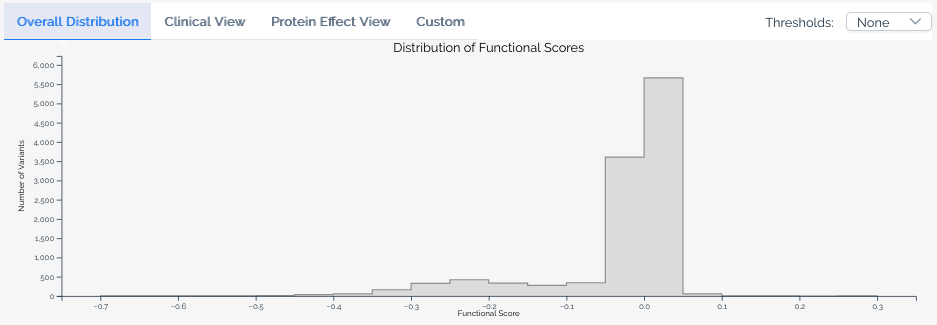
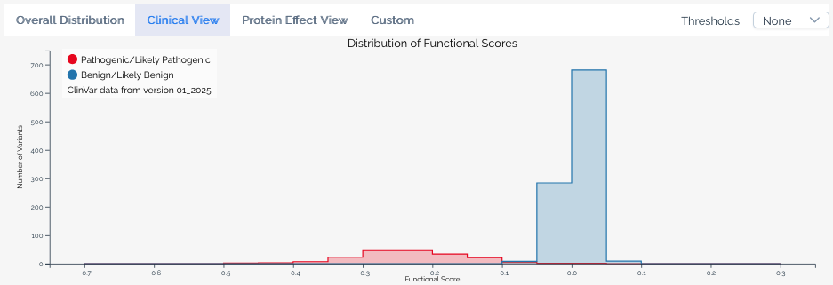
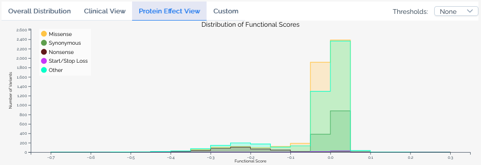
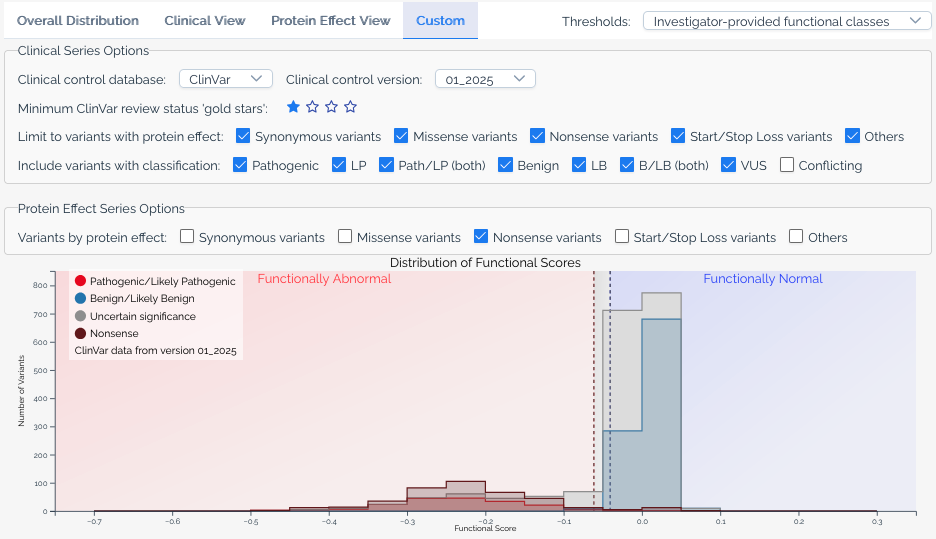
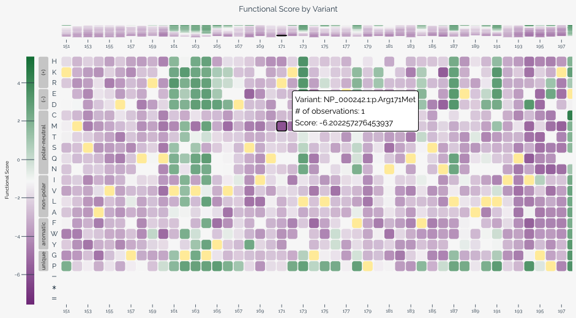
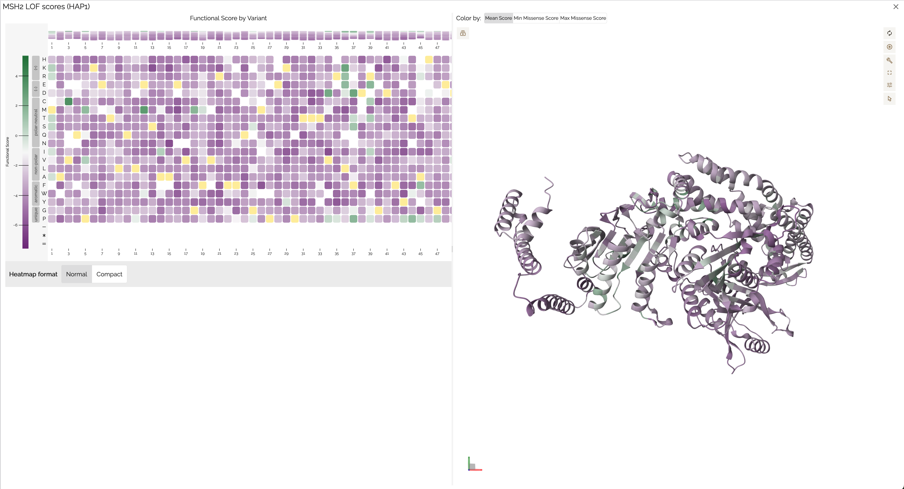

# Visualizations

MaveDB offers several built-in visualizations to help users explore and interpret variant effect data. These visualizations are automatically generated for [published](../submitting-data/publishing.md) score sets and displayed on the score set details page.

!!! tip "Linked visualizations"
    Selecting a variant in any visualization highlights it across all other visualizations on the page. For example, clicking a cell in the heatmap will highlight the corresponding bin in the histogram.

All visualizations can be exported as SVG images using the download button underneath the score set metadata.

## Histogram

The histogram displays the distribution of variant effect scores within a score set. Use the tab bar above the histogram to switch between available views — not all views are available for every score set, depending on the data and annotations present.

Hovering over a bin reveals the number of variants in that score range for each series, and shows which classification ranges the bin overlaps when a [score calibration](../reference/score-calibrations.md) is selected.

### Base view

The default view shows the overall score distribution for all variants in the score set.

<figure markdown="span">
  
  <figcaption>Base histogram visualization from <a href="https://mavedb.org/score-sets/urn:mavedb:00001250-a-1">urn:mavedb:00001250-a-1</a>, saturation genome editing of <em>BARD1</em>.</figcaption>
</figure>

### Clinical view

Available when a score set has been linked to [ClinVar annotations](external-integrations.md#clinvar). This view overlays the distribution of scores for variants classified as `Pathogenic` or `Likely pathogenic` and `Benign` or `Likely benign` in ClinVar, allowing users to assess how well the assay segregates known clinical variants. The ClinVar version used is always shown in the histogram legend.

<figure markdown="span">
  
  <figcaption>Clinical view of the histogram from <a href="https://mavedb.org/score-sets/urn:mavedb:00001250-a-1">urn:mavedb:00001250-a-1</a>, showing ClinVar pathogenic and benign variant distributions.</figcaption>
</figure>

### Protein effect view

Available when a score set includes [variant effect predictions](external-integrations.md#ensembl-vep). This view overlays the distribution of scores for variants predicted to have different effects on the protein, such as missense, nonsense, and synonymous variants.

<figure markdown="span">
  
  <figcaption>Protein effect view of the histogram from <a href="https://mavedb.org/score-sets/urn:mavedb:00001250-a-1">urn:mavedb:00001250-a-1</a>, showing score distributions by predicted protein effect.</figcaption>
</figure>

### Custom view

The custom view gives users full control over the histogram. Available options include:

- **ClinVar version** -- Select which version of ClinVar annotations to use.
- **Gold stars threshold** -- Filter ClinVar variants by their review status (star rating).
- **Additional significance categories** -- Add series for classifications beyond pathogenic and benign, such as `Uncertain significance` and `Conflicting classifications`.
- **Protein effect filters** -- Limit series to variants with specific predicted protein effects, or add separate series for different effect types.
- **Calibration overlays** -- When a score set has [score calibrations](../reference/score-calibrations.md), overlay functional classification ranges on the histogram.

<figure markdown="span">
  
  <figcaption>Custom view of the histogram from <a href="https://mavedb.org/score-sets/urn:mavedb:00001250-a-1">urn:mavedb:00001250-a-1</a>, with overlaid score calibrations, ClinVar VUS shown in gray, and a nonsense protein effect series.</figcaption>
</figure>

## Heatmap

The heatmap provides a two-dimensional view of variant effect scores across the target sequence, with positions along the horizontal axis and substitutions along the vertical axis. This visualization is particularly useful for identifying positional patterns in variant effects.

When variants are provided at the nucleotide level, users can toggle between nucleotide and amino acid views using the controls below the heatmap. In amino acid view, residues are ordered by hydrophobicity using the [Kyte-Doolittle scale](http://www.sciencedirect.com/science/article/pii/0022283682905150) and grouped by chemical class based on values from [Enrich2](https://genomebiology.biomedcentral.com/articles/10.1186/s13059-017-1272-5/figures/1).

Each cell represents a specific variant at a given position. Color intensity indicates the variant effect score, and wild-type variants are shown in yellow. Hovering over a cell reveals the variant's score, classification (if applicable), and [HGVS](../submitting-data/data-formats.md) notation. For long target sequences, you can scroll horizontally to explore the full heatmap.

When a baseline score is available from a [score calibration](../reference/score-calibrations.md), the heatmap color scale centers the normal color (purple) at the baseline score to provide better visual contrast for variants that deviate from expected function.

<figure markdown="span">
  
  <figcaption>Heatmap with a selected variant from <a href="https://mavedb.org/score-sets/urn:mavedb:00000050-a-1">urn:mavedb:00000050-a-1</a>, deep mutational scanning of <em>MSH2</em>.</figcaption>
</figure>

## Protein structure viewer

The protein structure viewer provides an interactive 3D view of variant effect scores mapped onto a protein structure using [Mol\*](https://molstar.org/). This visualization is available when the score set's target can be linked to a UniProt accession — either because the target was defined with a UniProt identifier, or because MaveDB was able to match the target sequence to a UniProt entry during [variant mapping](../reference/variant-mapping.md). If you don't see the structure viewer for your score set, the target may not have a matching UniProt record.

The viewer displays a side-by-side heatmap and 3D structure sourced from the [AlphaFold Protein Structure Database](https://alphafold.ebi.ac.uk/), with a color gradient applied based on the mean variant effect score at each position. Users can:

- **Rotate, zoom, and pan** the 3D structure to explore it from any angle.
- **Change the color scheme** to visualize different score metrics or classifications.
- **Click a residue** on the structure to view its associated variant effect scores.
- **Click and drag on the heatmap** to select a range of positions, highlighting the corresponding region on the structure.
- **Export the view** as a PNG image using the settings menu on the right side of the viewer.

<figure markdown="span">
  
  <figcaption>Protein structure viewer from <a href="https://mavedb.org/score-sets/urn:mavedb:00000050-a-1">urn:mavedb:00000050-a-1</a>, showing mean variant effect scores mapped onto the MSH2 3D structure.</figcaption>
</figure>

References:
<ul class="list-disc text-xs italic text-gray-400 ml-5 px-2 py-1">
  <li>Jumper, J et al. Highly accurate protein structure prediction with AlphaFold. <em>Nature</em> (2021)</li>
  <li>Fleming J. et al. AlphaFold Protein Structure Database and 3D-Beacons: New Data and Capabilities. <em>Journal of Molecular Biology</em> (2025)</li>
</ul>

## See also

- [Score calibrations](../reference/score-calibrations.md) -- learn how calibration data drives classification overlays in histograms and heatmaps.
- [External integrations](external-integrations.md) -- details on ClinVar annotations and VEP predictions shown in visualizations.
- [Downloading data](downloading.md) -- download the score and count data behind these visualizations.
- [Key concepts](../getting-started/key-concepts.md#score-sets) -- understand what score sets represent in the MaveDB data model.
