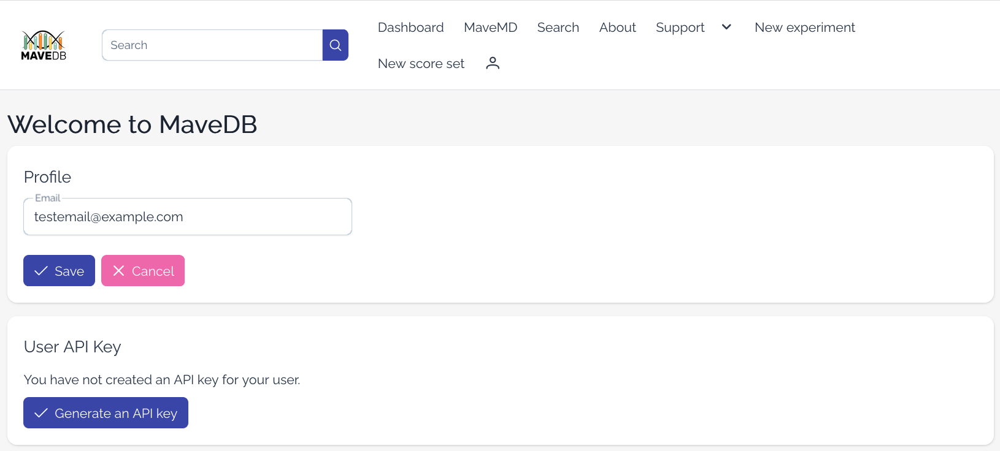

# User account management

User account authentication in MaveDB is handled through [ORCID](https://orcid.org/). If you do not have an ORCID iD, you can register a new one for free using their service.

Your MaveDB account is created automatically the first time you log in to MaveDB with your ORCID iD.

!!! warning "Contributors must log in first"
    To be added as a contributor to a dataset, you must have an account on MaveDB. This means that even if you have an ORCID iD, you will not be able to access private datasets or be added as a contributor until you have logged in to MaveDB at least once to create your account.

<figure markdown="span">
  
  <figcaption>The Profile settings page, where you can set your email address and manage your API key.</figcaption>
</figure>

## Setting an email address

MaveDB can only view public email addresses associated with your [ORCID iD](https://orcid.org/). If you do not have a public email address set and would like to receive emails from MaveDB, you can provide one on the [Profile settings page](https://www.mavedb.org/#/settings/) (requires login). To [upload datasets](../submitting-data/before-you-start.md), you must provide an email address.

!!! question "Why is an email address required for uploading?"
    The MaveDB team may need to contact dataset uploaders if issues are discovered with their data, such as mapping problems, metadata inconsistencies, or questions during curation. Providing a working email address ensures we can reach you to resolve these issues quickly and make your data as useful as possible to the community.

## API keys {#api-access-tokens}

Users may generate an API key to authenticate with the [MaveDB API](https://api.mavedb.org/docs) (see also [API quickstart](../programmatic-access/api-quickstart.md)). This key allows you to perform actions such as uploading and modifying datasets programmatically, fetching [private datasets](../reference/accession-numbers.md), or managing your account. You can generate and revoke API keys on the [Profile settings page](https://www.mavedb.org/#/settings/) (requires login).

Only one API key can be active for a given account. Generating a new key will invalidate the previous one.

!!! warning "Keep your API key secure!"
    Your API key grants the same permissions as your MaveDB account, including access to private datasets and the ability to modify data. Do not share your key with others or expose it in public code repositories. If you believe your key has been compromised, revoke it immediately from the Profile settings page.

    **MaveDB team members will never ask for your API key.** If you receive a request for your key, please report it to the MaveDB team immediately.

## See also

- [Key concepts](key-concepts.md) -- understand the MaveDB data model before submitting or accessing data.
- [API quickstart](../programmatic-access/api-quickstart.md) -- get started with programmatic access to MaveDB.
- [Python usage](../programmatic-access/python-usage.md) -- use the `mavedb` package for local validation and programmatic submission.
- [Before you start](../submitting-data/before-you-start.md) -- prerequisites for submitting data to MaveDB.
