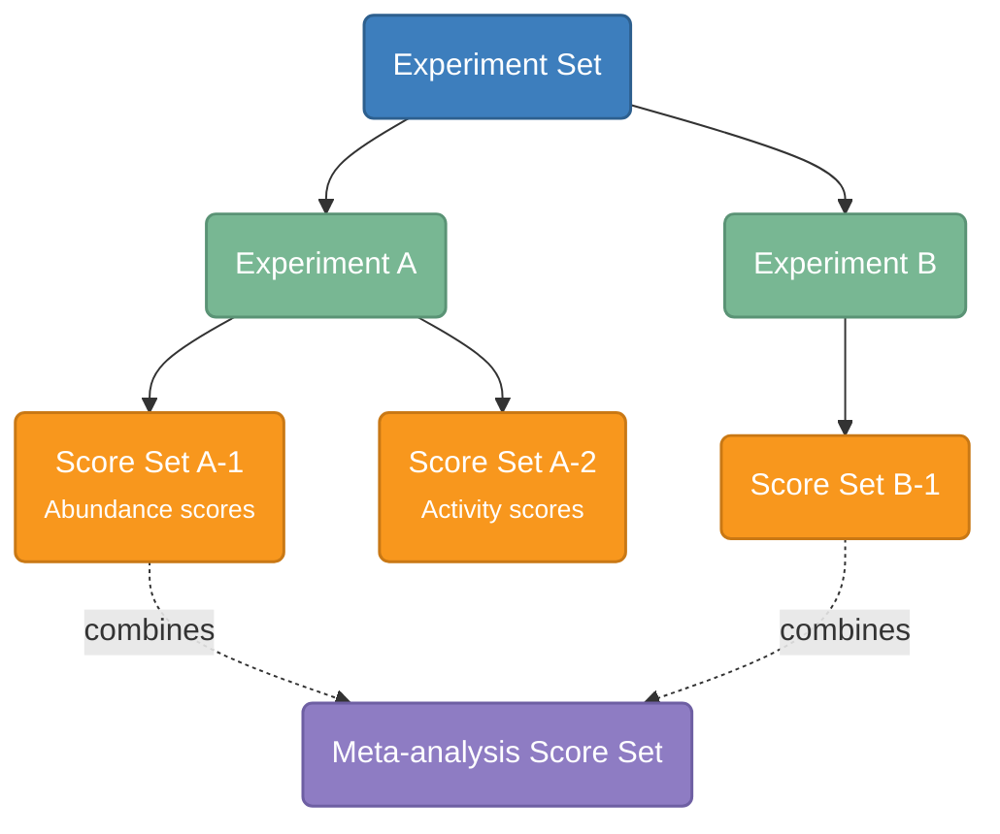

# Key Concepts

This page describes the core data model and terminology used throughout MaveDB. Understanding these concepts will help you navigate the database, [submit your own data](../submitting-data/before-you-start.md), and interpret datasets contributed by others.

## Data model overview

MaveDB organizes data in a three-level hierarchy: **experiment sets** contain **experiments**, which contain **score sets**. MaveDB also supports **meta-analysis score sets**, which are linked to existing score sets rather than to an experiment.

The diagram below shows a real-world example of this structure using data from a *BRCA1* study:

<figure markdown="span">
  
  <figcaption>Data model for <a href="https://www.mavedb.org/#/experiment-sets/urn:mavedb:00000003/">urn:mavedb:00000003</a>, a BRCA1 experiment set with two functional assays and four score sets.</figcaption>
</figure>

This experiment set describes two distinct assays performed on a single *BRCA1* variant library, each with two associated score sets. Each assay (symbolized by the yeast and bacteriophage and their associated sequencing instruments) is described in its own experiment record, and each experiment has its own score set records that describe the analysis and results (symbolized by the computer and data table).

## Experiment sets

Experiment sets group related experiments together. They do not have their own data or metadata -- they exist purely as an organizational container.

**When to use a single experiment set:** Group experiments that describe different functional assays performed on the same target and described in the same publication. For example, if a study performed both a yeast complementation assay and a phage display assay on the same variant library, these would be two experiments under one experiment set ([example](https://www.mavedb.org/#/experiment-sets/urn:mavedb:00000003/)).

**When to create multiple experiment sets:** In general, an experiment set should contain data for a single target. It is not necessary to include all data from a single publication or research project under one experiment set.

Experiment sets are created automatically when the first associated experiment is saved. To add another experiment to an existing experiment set, use the **Add an experiment** button on the experiment set page.

## Experiments

Experiments describe the data generated from performing a MAVE on a target. This includes all steps of the experimental procedure up to and including high-throughput sequencing: library construction, assay design, and sequencing strategy ([example](https://www.mavedb.org/#/experiments/urn:mavedb:00000003-a/)).

!!! note
    Data analysis steps -- including read filtering, read counting, and score calculation -- are described in a [score set](#score-sets), not in the experiment record.

Experiments also store publication references. MaveDB supports PubMed IDs, bioRxiv/medRxiv preprint IDs, and Crossref DOIs, and stores structured metadata for each reference (journal or preprint server, all author names). MaveDB distinguishes between a **primary reference**, which describes the data contained in the record, and **secondary references**, which describe methods, key reagents, or software used to generate the data.

**When to create multiple experiments:** Publications that perform more than one functional assay should be represented as multiple experiments organized under a single experiment set. Each functional assay should be described in its own experiment record. This still applies to experimental designs where the differences between assays were relatively minor, such as varying the temperature or the concentration of a small molecule.

**Replicates:** Replicate assays should not be reported as separate experiments. Instead, the number and nature of the replicates should be clearly stated in the experiment's methods section.

To assign a new experiment to an existing experiment set, use the **Add an experiment** button on the experiment set page.

## Score sets

Score sets are the records that describe the scores generated from the raw data described in their associated experiment. They are the primary way that users interact with the data deposited into MaveDB. This includes all steps following the high-throughput sequencing step, including read filtering, read counting, and score calculations ([example](https://www.mavedb.org/#/score-sets/urn:mavedb:00000003-a-1/)). For details on the expected file formats, see [Data formats](../submitting-data/data-formats.md).

All score sets must be associated with an existing experiment.

!!! tip "Counting datasets"
    When MaveDB reports the number of **datasets** in the database, this count is at the score set level, since each score set represents a distinct set of variant effect measurements. For example, an experiment that produced both abundance scores and activity scores would contribute two datasets to the total.

A score set contains:

- **Variant effect scores** -- A numeric value for each variant describing its functional effect. Scores are required for every variant in the dataset.
- **Optional data columns** -- Any number of additional numeric columns named by the submitter, such as variance estimates, confidence intervals, standard errors, or replicate-level data.
- **Optional count data** -- Variant counts from the sequencing readout, which support the development of new statistical models for calculating variant effect scores. We strongly encourage submitters to provide count data when available.
- **Target information** -- Details about the [target sequence](#targets) that was mutagenized.
- **Methods** -- A description of how scores were calculated from the raw sequencing data.

**When to create multiple score sets:** Use multiple score sets when distinct methods were used to calculate scores for raw data described by the experiment. Common examples include producing both abundance-based and activity-based scores from the same experiment, or reanalyzing existing data with updated scoring methods.

**Imputed or normalized scores:** When uploading results based on imputation or complex normalization, it is recommended to upload a more raw form of the scores (e.g., enrichment ratios) as a normal score set, and then use a [meta-analysis score set](#meta-analysis-score-sets) to describe the imputed or normalized results. This preserves the original scores and ensures they remain discoverable for users who want to evaluate their own methods or build models that may be sensitive to data normalization.

To assign a new score set to an existing experiment, use the dropdown at the top of the score set form.

## Meta-analysis score sets

Meta-analysis score sets have all the same attributes as a regular score set, but they are linked to one or more existing score sets rather than an existing experiment. This is useful for analyses that combine or re-analyze data from multiple score sets, such as:

- Combining scores across multiple experiments
- Applying imputation or advanced normalization methods to existing scores
- Re-scoring data using updated methods or models

For example, [urn:mavedb:00000055-0-1](https://www.mavedb.org/#/score-sets/urn:mavedb:00000055-0-1/) is a meta-analysis score set for the gene *NUDT15* that combines the results of two separate functional assays into a single composite *function score* summarizing performance across both assays.

## Targets

All variants in a MaveDB score set are described relative to a **target** -- the sequence that was mutagenized to create the variant library. MaveDB supports two types of targets:

- **Sequence-based targets**: Based on the full sequence that was mutagenized, which may or may not correspond to a known sequence in an external database. Use this when the exact sequence used differs from known references (e.g., codon-optimized sequences, non-reference backgrounds).
- **Accession-based targets**: Based on sequences fully described in an external database (RefSeq or Ensembl). Use this when variants were generated by editing the genome directly or by mutagenizing a known reference sequence.

Each score set must be associated with at least one target. Some experiments (such as protein-protein interaction assays) may associate multiple targets with a single score set.

!!! info "See also"
    For detailed information about target types and metadata, see the [Targets](../submitting-data/targets.md) page.

## Contributors

Record owners can add additional users as **contributors** to share access to their datasets. Contributors have the same permissions as the owner, except they cannot delete the record.

!!! info "See also"
    For details on adding contributors, permissions, and cross-record behavior, see the [Contributors](../submitting-data/metadata-guide.md#contributors) section of the Metadata Guide.

## Accession numbers

Every record in MaveDB is assigned a unique accession number (URN). Published records have accession numbers in the format `urn:mavedb:NNNNNNNNN`, where the number hierarchy reflects the data model:

| Record type      | Format example              | Description                          |
|------------------|-----------------------------|--------------------------------------|
| Experiment set   | `urn:mavedb:00000003`       | Top-level identifier                 |
| Experiment       | `urn:mavedb:00000003-a`     | Suffix letter under the experiment set |
| Score set        | `urn:mavedb:00000003-a-1`   | Suffix number under the experiment   |

Records that have not yet been published are assigned temporary accession numbers beginning with `tmp:` instead of `urn:mavedb:`. These temporary records are only visible to the owner and contributors. See [Publishing](../submitting-data/publishing.md) for details on making records public.

!!! info "See also"
    For detailed information about accession number formats, see the [Accession Numbers](../reference/accession-numbers.md) reference page.

## Variant representation

Variants in MaveDB score sets are described using [MAVE-HGVS](../submitting-data/data-formats.md#variant-columns), an adaptation of the HGVS Sequence Variant Nomenclature designed for MAVE data. While standard HGVS packages rely on sequence database entries that may not be available for all MAVE target sequences, MAVE-HGVS validates variants against the target sequence provided with the score set, supporting both DNA and protein variant descriptions including substitutions, small insertions and deletions, and multi-mutants.

For score sets with [accession-based targets](#targets) (such as those from saturation genome editing experiments), variants can be defined with respect to a transcript accession or human genome reference, with validation handled by a local sequence database.

After upload, human-targeting score sets are automatically processed through [variant mapping](../reference/variant-mapping.md), which translates variants to standard genomic coordinates and [GA4GH VRS](https://vrs.ga4gh.org/) format for interoperability with clinical and research databases.

## Data licensing

MaveDB supports [Creative Commons](https://creativecommons.org/) licenses for score sets. The recommended license is **CC0** (public domain dedication), which maximizes data reuse and enables inclusion in [bulk downloads](../finding-data/downloading.md#bulk-downloads-via-zenodo) and integration with downstream resources. Nearly all datasets in MaveDB have been licensed at the CC0 level.

## See also

- [Searching datasets](../finding-data/searching.md) -- find score sets by gene, organism, or publication.
- [Visualizations](../finding-data/visualizations.md) -- explore variant effect data through histograms, heatmaps, and 3D structure views.
- [Score calibrations](../reference/score-calibrations.md) -- learn how functional scores are calibrated for clinical interpretation.
- [Controlled vocabulary](../reference/controlled-vocabulary.md) -- definitions of terms used in MaveDB metadata.
- [Variant mapping](../reference/variant-mapping.md) -- how MAVE variants are mapped to genomic coordinates.
