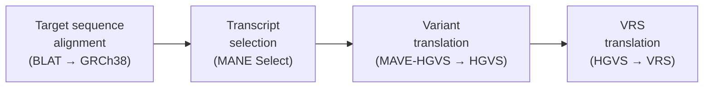

# Forward mapping

Forward mapping is the first stage of the [mapping and annotation pipeline](index.md). MaveDB uses the variant descriptions in a score set's [score and count data tables](../submitting-data/data-formats.md) to place each variant onto standard human reference coordinates. This is what allows MaveDB to integrate with [external resources such as ClinGen, ClinVar, and gnomAD](../finding-data/external-integrations.md), powers the [MaveMD variant search](../mavemd/variant-search.md), and enables [score calibrations](../reference/score-calibrations.md) for clinical interpretation.

!!! note
    Mapping is only performed for datasets with a **human** target sequence.

This method was developed by [Arbesfeld et al. (2025)](https://doi.org/10.1186/s13059-025-03647-x) and is described in detail in the linked publication. The sections below give a mechanical overview of the pipeline and surface the notable choices behind it — the ones a reader might reasonably contest.

## Why mapping is needed

Most MAVE experiments describe variants relative to an assay-specific target sequence uploaded by the data submitter. This target sequence is often not identical to a human reference sequence — it may be codon-optimized for expression in a model organism, contain synthetic elements such as minigene constructs, or represent only a portion of the full gene. Additionally, protein-level variants from cDNA-based assays may span exon boundaries when represented at the genomic level.

These differences mean that MAVE variant descriptions cannot be directly compared to variants reported by clinical sequencing pipelines or described in databases like ClinVar. Mapping resolves this by translating each variant from the experimental target-sequence coordinate system to standard human reference coordinates (GRCh38).

## Mapping process

Mapping runs when a score set's variant data is [uploaded](../submitting-data/upload-guide.md). It involves the following steps:

1. **Target sequence alignment**: The target sequence is aligned to the GRCh38 assembly with [BLAT](https://genome.ucsc.edu/FAQ/FAQblat.html) — nucleotide targets directly against the genome, amino-acid targets in protein space instead. The alignment fixes the target's genomic location and candidate transcripts, and the **gene is taken from the locus the target aligns to**, not from a submitter-declared gene name. *(A deliberate choice: alignment is the objective signal, but it means a target that aligns unexpectedly resolves to whatever gene sits at that locus.)*

2. **Transcript selection**: MaveDB maps to a **single representative transcript** per target rather than to every overlapping transcript, prioritizing [MANE Select](https://www.ncbi.nlm.nih.gov/refseq/MANE/) (the clinical-reporting standard), then MANE Plus Clinical, and falling back to the longest compatible transcript when no MANE transcript applies. An offset is computed to locate the MAVE sequence within the selected reference. *(A deliberate choice: one stable, standard coordinate system, at the cost of not representing alternate transcripts.)*

3. **Variant translation**: Each variant in the score and count data tables is converted from [MAVE-HGVS](../submitting-data/data-formats.md#variant-columns) format to standard HGVS format and translated with respect to the selected transcript. This step accounts for any offset between the target sequence and the transcript.

4. **VRS translation**: The HGVS descriptions are converted to [GA4GH VRS](https://vrs.ga4gh.org/en/stable/) format using the [VRS-Python](https://github.com/ga4gh/vrs-python) library. Each representation receives a unique, computable VRS digest, enabling precise identification and data provenance.

!!! warning "Review mapping results"
    In some cases, variants may not be successfully mapped due to issues such as ambiguous target sequences, complex variant types, or discrepancies between the target and reference genome. MaveDB logs these instances and provides feedback to data contributors to help resolve mapping issues.

    Although some mapping failures represent true limitations of the data, others can be addressed by correcting errors in the submitted variants or target sequences.

    **It is highly recommended that data contributors review the mapping results after uploading a score set to ensure that variants have been accurately mapped.** Contributors can view mapping results on the score set page and download a report of mapped and unmapped variants.

    Mapping failures do not prevent datasets from being published in MaveDB, but a successful mapping is required for certain features such as [variant search](../mavemd/variant-search.md), linkages with certain [external resources](../finding-data/external-integrations.md), and inclusion in [MaveMD](../mavemd/index.md).

## How a mapped variant is represented

A mapped variant is not stored as a single object but as a small **set of representations**:

- The original **assay-level** (target-relative) form is retained, so the experimental context is never lost.
- Each **reference-level** representation — genomic, coding, and protein, wherever the biology allows — is stored as a distinct allele, each carrying its own GA4GH VRS object and stable digest.

This unified, per-level representation is what lets a variant be expressed consistently across molecular levels and matched against external resources. The [reverse translation and projection](reverse-translation.md) stage fills in the levels a given assay did not measure. [Interpreting Annotated Variants](../interpreting-annotated-variants.md) explains how to read the resulting multi-level view. *(A deliberate choice: per-level VRS alleles plus the retained assay-level form give cross-level identity and provenance, rather than collapsing a variant to a single canonical representation.)*

## Assay target vs. human reference

Because an assay's target sequence is often not identical to the human reference, the assay-level representation and its mapped reference-level counterpart can **differ**. Retaining both (as above) keeps that difference visible rather than flattening it away — which is a core provenance goal of mapping: the original experimental context is never lost, downstream users can see exactly how the assay relates to the human reference, and clinical users can judge whether the experimental evidence is appropriate for their interpretation context.

These differences are expected, not errors. They arise from legitimate differences between experimental and reference sequences:

- **Codon optimization** — synonymous nucleotide changes introduced to optimize expression in the assay system.
- **Non-homologous sequence content** — synthetic elements like minigene constructs that do not align to the human genome.
- **Exon-boundary spanning** — protein-level changes that, at the genomic level, correspond to nucleotide changes across exon–intron boundaries.

## What isn't mapped

Not every submitted variant yields a mapped representation, and an absence is not always a failure. MaveDB distinguishes two cases:

- **Benign absences** — variants that legitimately have no reference-level representation, recorded but with no mapped allele. The main case is a **submitted intronic variant**: an intronic position has no protein consequence and cannot be represented at the levels MaveDB serves. Other changes with no protein consequence are treated the same way.
- **Failures** — variants that *should* map but didn't: ambiguous alignments, complex or malformed variant descriptions, or discrepancies between the target and reference genome. These are surfaced in the mapping report for the contributor to review.

Only genuine failures count against a score set's mapping; benign absences do not, and neither blocks publication.

## Programmatic access

Mapped representations are available through the [MaveDB API](../programmatic-access/api-quickstart.md) and are downloadable from individual score set pages in [VRS and VA-Spec JSON formats](../reference/data-standards.md#vrs-variant-representation).

## See also

- [Variant mapping & annotation](index.md) — the pipeline this stage belongs to
- [Reverse Translation & Projection](reverse-translation.md) — deriving the levels an assay did not measure
- [Interpreting Annotated Variants](../interpreting-annotated-variants.md) — reading a variant's representations across levels
- [External Integrations](../finding-data/external-integrations.md) — how mapping connects MaveDB to external genomic platforms
- [Data Formats](../submitting-data/data-formats.md) — how variants are described in score and count data files
- [Targets](../submitting-data/targets.md) — sequence-based and accession-based target types
