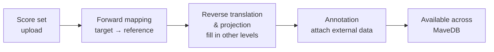

# Variant mapping & annotation

MaveDB describes each uploaded variant relative to the experiment's own target sequence. Before a variant can be searched, compared to clinical databases, or interpreted clinically, MaveDB runs it through a pipeline that **maps** it onto standard human reference coordinates and **annotates** it with data from external resources. This section documents how that pipeline works.

!!! tip "Looking for what the results *mean*?"
    This section covers *how* variants are processed. For what the resulting representations and labels mean — Measured, Resolved, Convergent, Candidate — and how to weigh them, see [Interpreting Annotated Variants](../interpreting-annotated-variants.md).

!!! note
    Mapping and annotation are only performed for datasets with a **human** target sequence.

## The pipeline at a glance

1. **[Forward mapping](../reference/variant-mapping.md)** — the target sequence is aligned to GRCh38, a representative transcript is selected, and each variant is translated from the experiment's coordinates into standard HGVS and VRS representations. This is where concordance with the human reference is assessed.
2. **Reverse translation & projection** — the levels the assay *didn't* measure are derived from the one it did. A protein-only measurement gains coding and genomic representations; a DNA measurement gains its protein consequence. See [Reverse Translation & Projection](reverse-translation.md).
3. **[Annotation](annotation.md)** — the mapped and derived representations are cross-referenced against external resources (ClinVar, gnomAD, Ensembl VEP) at the level where each resource describes variants.
<!-- TODO: repoint stage 1 to mapping/forward-mapping.md after migration -->

!!! info "Rolling out"
    Reverse translation and projection of protein-only variants are still being deployed across MaveDB. Some published datasets may not yet show the full set of derived representations.

## When the pipeline runs

Mapping and annotation run automatically when a score set's variant data is [uploaded](../submitting-data/upload-guide.md). Results are visible on the score set page. A score set can also be re-mapped later; when that happens, the earlier results are superseded and the new ones take their place.

!!! warning "Review your mapping results"
    Some variants may not map — because of ambiguous target sequences, complex variant types, or discrepancies between the target and reference genome. Mapping failures do not prevent publication, but mapped variants are required for [variant search](../mavemd/variant-search.md), some [external integrations](../finding-data/external-integrations.md), and inclusion in [MaveMD](../mavemd/index.md). **Contributors are strongly encouraged to review mapping results after upload**; MaveDB flags failures and provides a downloadable report.

## See also

- [Interpreting Annotated Variants](../interpreting-annotated-variants.md) — what the mapped and derived representations mean
- [External Integrations](../finding-data/external-integrations.md) — the external resources behind annotations
- [Data Formats](../submitting-data/data-formats.md) — how variants are described on upload
