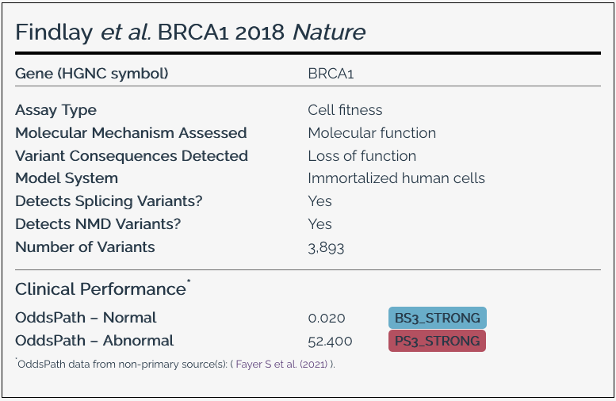

# Assay facts

MaveDB captures key facts about the experimental assay used to generate variant effect measurements from controlled keywords based on a [controlled vocabulary](controlled-vocabulary.md). This information is then used to generate a concise summary of assay facts that is displayed on the [score set](../getting-started/key-concepts.md) page.

<figure markdown="span">
  
  <figcaption>Example of the assay facts section from a score set. This figure shows the assay facts section from <a href="https://mavedb.org/score-sets/urn:mavedb:00000097-0-2">urn:mavedb:00000097-0-2</a>, which describes saturation genome editing of <em>BRCA1</em>.</figcaption>
</figure>

## Assay fact sheet properties

**Gene Symbol**
:   The HGNC gene symbol for the target gene being assayed.

**Assay type**
:   The type of functional assay used to measure variant effects. This corresponds to the [phenotypic assay method](controlled-vocabulary.md#phenotypic-assay-method) controlled vocabulary term.

**Molecular mechanism**
:   The molecular mechanism by which the assay measures variant effects. This corresponds to the [molecular mechanism assessed](controlled-vocabulary.md#molecular-mechanism-assessed) controlled vocabulary term.

**Variant consequences detected**
:   The types of variant consequences that the assay is capable of detecting. This corresponds to the [phenotypic assay mechanism](controlled-vocabulary.md#phenotypic-assay-mechanism) controlled vocabulary term.

**Model system**
:   The biological system in which the assay was performed. This corresponds to the [model system](controlled-vocabulary.md#phenotypic-assay-model-system) controlled vocabulary term.

**Detects splicing variants**
:   Whether the assay is capable of detecting splicing variants. Based on assay design, and inferred based on a combination of the [variant library creation method](controlled-vocabulary.md#variant-library-creation-methods) and other terms.

**Detects NMD variants**
:   Whether the assay is capable of detecting NMD variants. Based on assay design, and inferred based on a combination of the [variant library creation method](controlled-vocabulary.md#variant-library-creation-methods) and other terms.

**OddsPaths**
:   The OddsPath score calculated for abnormal and normal functional readouts, if applicable. These OddsPaths are based on the framework described in [Brnich et al., 2019](https://doi.org/10.1186/s13073-019-0690-2).

    !!! note
        OddsPath calculations are provided when available.

        For some assays, MaveDB maintainers may have selected OddsPaths other than those submitted by the data contributor, based on updated [calibrations](score-calibrations.md) or reanalyses of the data. In these cases, the source of the OddsPath scores will be indicated on the score set page.

## See also

- [Score Calibrations](score-calibrations.md) -- How functional classifications and evidence strengths are determined
- [Controlled Vocabulary](controlled-vocabulary.md) -- The full list of terms used to populate assay facts
- [Metadata Guide](../submitting-data/metadata-guide.md) -- How to provide metadata and keywords when submitting data
- [MaveMD](../mavemd/index.md) -- Clinical interpretation tools that use assay facts
