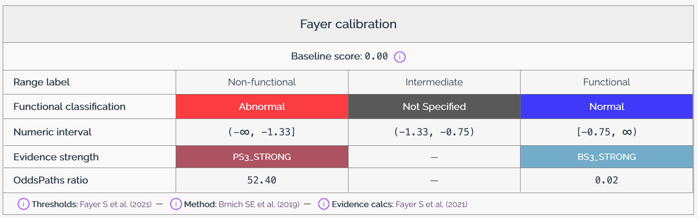

# Score calibrations

Score calibrations in MaveDB provide a way to give additional context to variant effect scores by mapping them to known reference points. This helps users interpret the scores in a biologically meaningful way. A score calibration is associated with a [score set](../getting-started/key-concepts.md) and consists of four parts: a baseline score, a set of classifications, a set of evidence strengths, and calibration metadata.

You can add a calibration to a score set from multiple places in the MaveDB interface: from the score set page, from the dedicated calibrations page, or during score set creation in the upload form. Calibrations can also be created and managed via the [API](../programmatic-access/api-quickstart.md).

<figure markdown="span">
  
  <figcaption>The calibration section on a score set page, showing the baseline score, functional classifications, evidence strengths, and calibration metadata.</figcaption>
</figure>

## Baseline score

The baseline score represents the expected score for a variant that has no effect on the phenotype being measured. This score serves as a reference point for interpreting other variant effect scores in the dataset. The baseline score is typically derived from known neutral variants or from the distribution of scores in the dataset, and may also be described as the **wild-type** or **reference** score.

The baseline score should be provided as a numeric value along with a description of how it was determined. For example, if the baseline score is derived from the average score of known synonymous variants, this should be noted in the description. MaveDB uses the baseline score in the [heatmap](../finding-data/visualizations.md#heatmap) to set the color scale, and it is displayed along with the calibration information in the score set details.

!!! tip "Relationship between baseline score and functional classifications"
    When providing a baseline score and functional classifications categorized as `Normal`, it is required that the baseline score falls within the `Normal` classification range. This ensures that the baseline score serves as an appropriate reference point for interpreting other variant effect scores in the dataset. If the baseline score does not fall within the `Normal` classification range, users may be misled about the expected score for neutral variants, which could lead to incorrect interpretations of the data.

## Functional classifications

Functional classifications provide a way to categorize variants based on their effect scores. These classifications help users understand the biological significance of the scores and facilitate comparisons between different variants. MaveDB supports a controlled vocabulary for functional classifications, which includes the following terms:

- **Normal**: Indicates that the variant has no significant effect on the phenotype.
- **Abnormal**: Indicates that the variant has a significant effect on the phenotype.
- **Not specified**: Indicates that the effect of the variant is unknown or has not been determined.

There are two ways to assign functional classifications to variants in MaveDB:

1. **Threshold-based classification**: Users can define score thresholds that determine the functional classification of variants. For example, variants with scores above a certain threshold may be classified as `Normal`, while those below the threshold are classified as `Abnormal`.
2. **Direct assignment**: Users can directly assign functional classifications to individual variants by uploading a CSV file. The file must contain a `class_name` column with classification labels matching those defined in the calibration, and at least one variant identifier column to link each classification to a variant in the score set. The supported identifier columns are:

    - `variant_urn` — the MaveDB variant URN (preferred when available)
    - `hgvs_nt` — the nucleotide-level HGVS notation
    - `hgvs_pro` — the protein-level HGVS notation

    If multiple identifier columns are present, `variant_urn` takes priority, followed by `hgvs_nt`, then `hgvs_pro`. Every variant identifier in the file must correspond to an existing variant in the score set, and every class defined in the calibration must appear at least once in the file.

## Evidence strengths

Evidence strengths indicate the level of evidence that may be used for variant interpretation. MaveDB supports a controlled vocabulary for evidence strengths, which includes the following terms based on ACMG/AMP guidelines:

- **Very Strong**
- **Strong**
- **Moderate**
- **Supporting**

You may assign a particular evidence strength to each functional classification. Note that for `Abnormal` classifications, you must provide a pathogenic evidence strength, while for `Normal` classifications, you must provide a benign evidence strength. For `Not specified` classifications, evidence strengths may not be submitted.

You may also include odds of pathogenicity (`OddsPath`) values for each classification. These values provide a quantitative measure of the strength of evidence associated with each classification and may be used in variant interpretation. For more information on how OddsPath values relate to evidence strengths and recommendations for their application, see the guidelines provided by [Brnich et al., 2019](https://doi.org/10.1186/s13073-019-0690-2).

## Calibration metadata

Calibration metadata provides additional context about the score calibration, including information about how the calibration was performed and any relevant references or notes. This metadata may include:

- A title for the calibration
- A description of the methods used to determine the baseline score and functional classifications.
- Any additional notes or comments that may be useful for users interpreting the calibration, especially with regard to the baseline score and functional classifications.
- Whether the calibration should be marked as **research use only**, indicating that it is not intended for clinical or diagnostic purposes.

In addition, users may provide three types of publication references (e.g., a DOI, PubMed ID, or bioRxiv/medRxiv ID) to support the calibration:

- **Method sources**: The publication describing the calibration method — i.e., the overall approach used to derive functional classifications and evidence strengths from raw scores. Required for all calibrations.
- **Threshold sources**: The publication describing how score thresholds or classification boundaries were determined. Required when functional classifications are provided.
- **Evidence sources**: The publication describing how ACMG/AMP evidence strengths were assigned to the functional classifications. Required when evidence strengths are provided.

## Calibration privacy

By default, score calibrations are not visible to all MaveDB users. However, you may choose to [publish](../submitting-data/publishing.md) a calibration after it has been uploaded. Private calibrations are only visible to the user who uploaded them and any users marked as contributors on the associated score set. Published calibrations are visible to all MaveDB users and may be used in visualizations and interpretations of the associated score set.

!!! note
    Unlike experiments and experiment sets, calibrations are **not** automatically published when their associated score set is published. Each calibration must be published separately.

!!! warning
    Once a calibration has been published, it cannot be made private again, deleted, nor edited. Please ensure that you are comfortable with making the calibration public before publishing it.

## Research use only calibrations

Calibrations may be marked as **research use only** (RUO), indicating that they are not intended for clinical or diagnostic purposes. This designation is appropriate for calibrations that use experimental or exploratory methods, have not been independently validated, or are based on limited clinical control data.

Research use only calibrations:

- Are displayed with a prominent RUO label to distinguish them from calibrations intended for clinical interpretation.
- May not be designated as [primary calibrations](#primary-calibrations).
- Are still visible to all users when published, but the RUO label signals that they should not be used as the sole basis for clinical variant classification.

The RUO designation is set when the calibration is created and cannot be changed after publication.

## Primary calibrations

A primary calibration is the main score calibration associated with a score set. Each score set in MaveDB may have at most one primary calibration. The primary calibration is used by default when displaying the score set in [visualizations](../finding-data/visualizations.md) and when interpreting variant effect scores.

After uploading a score calibration to MaveDB, you may choose to designate it as the primary calibration for the associated score set. If a score set already has a primary calibration, you must demote the existing primary calibration before designating a new one. A calibration must be publicly visible to be marked as the primary calibration, and research use only calibrations may not be designated as primary calibrations.

!!! note
    MaveDB maintainers may review primary calibrations to ensure that they meet quality standards and are appropriate for use in visualizations and interpretations, and retain the right to remove primary calibration status from any calibration that does not meet these standards.

## Investigator and community calibrations

Any authenticated MaveDB user may upload a score calibration to any published score set. MaveDB distinguishes between two types of calibration providers:

- **Investigator calibrations** are uploaded by the score set owner or a user marked as a [contributor](../submitting-data/metadata-guide.md#contributors) on the score set. When there is no primary calibration, investigator calibrations are given priority in the default display order.
- **Community calibrations** are uploaded by any other authenticated user. Community calibrations provide a way for external researchers to contribute independent interpretations of a dataset.

### Permission differences

Investigator and community calibrations share most behaviors — both can be published, and published calibrations of either type are visible to all users and cannot be edited or deleted. The key differences apply while a calibration is still private:

| Action | Investigator calibration | Community calibration |
| --- | --- | --- |
| **View** (private) | Visible to all score set contributors | Visible only to the calibration owner |
| **Edit** (private) | Editable by all score set contributors | Editable only by the calibration owner |
| **Delete** (private) | Only the calibration owner | Only the calibration owner |
| **Publish** | Only the calibration owner | Only the calibration owner |
| **Change rank** (promote/demote primary) | Score set contributors and calibration owner | Score set contributors only — the community calibration owner cannot change rank |

The rank restriction means that community calibration providers cannot promote their own calibration to primary status. Instead, the score set team decides whether to elevate a community calibration.

## See also

- [Visualizations](../finding-data/visualizations.md) -- How calibrations influence the histogram and heatmap displays.
- [Downloading Data](../finding-data/downloading.md#annotated-variants-va-spec) -- How calibration data is included in VA-Spec annotated variant downloads.
- [Upload Guide](../submitting-data/upload-guide.md) -- Step-by-step instructions for creating score sets, including adding calibrations.
- [External Integrations](../finding-data/external-integrations.md) -- How MaveDB connects with ClinVar, ClinGen, and other resources that use calibration-informed classifications.
- [Accession Numbers](accession-numbers.md#urns-for-other-resources) -- How calibration URNs are structured in MaveDB.
