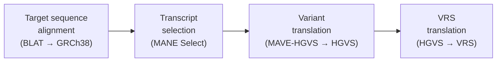

# Variant mapping

MaveDB uses the variant descriptions provided in the [score and count data tables](../submitting-data/data-formats.md) to map variants to genomic coordinates on the human reference genome. This mapping allows MaveDB to integrate with [external resources such as ClinGen, ClinVar, and gnomAD](../finding-data/external-integrations.md), powers the [MaveMD variant search](../mavemd/variant-search.md), and enables [score calibrations](score-calibrations.md) for clinical interpretation.

!!! note
    Variant mapping is only performed for datasets with a human target sequence.

This process was developed by [Arbesfeld et al. (2025)](https://doi.org/10.1186/s13059-025-03647-x) and is described in detail in the linked publication. The sections below summarize the method and its key considerations.

## Why mapping is needed

Most MAVE experiments describe variants relative to an assay-specific target sequence uploaded by the data submitter. This target sequence is often not identical to a human reference sequence — it may be codon-optimized for expression in a model organism, contain synthetic elements such as minigene constructs, or represent only a portion of the full gene. Additionally, protein-level variants from cDNA-based assays may span exon boundaries when represented at the genomic level.

These differences mean that MAVE variant descriptions cannot be directly compared to variants reported by clinical sequencing pipelines or described in databases like ClinVar. Mapping resolves this by translating each MAVE variant from the experimental target sequence coordinate system to standard human reference coordinates (GRCh38), producing both pre-mapped (target-relative) and post-mapped (reference-relative) representations.

## Mapping process

Variants are mapped to genomic coordinates upon [upload of a score set](../submitting-data/upload-guide.md). The mapping process involves the following steps:

1. **Target sequence alignment**: The target sequence provided with the score set is aligned to the GRCh38 human genome assembly using [BLAT](https://genome.ucsc.edu/FAQ/FAQblat.html). This determines the genomic location of the target sequence and identifies candidate transcripts. For targets specified at the amino acid level, BLAT aligns to the protein reference space; for nucleotide targets, alignment is performed directly against the genome.

2. **Transcript selection**: From the candidate alignments, MaveDB selects a representative RefSeq transcript. The selection prioritizes [MANE Select](https://www.ncbi.nlm.nih.gov/refseq/MANE/) transcripts (the community standard for reporting clinical variants), followed by RefSeq Select transcripts, and then the longest matching transcript. An offset is computed to determine the precise location of the MAVE sequence within the selected reference sequence.

3. **Variant translation**: Each variant in the score and count data tables is converted from [MAVE-HGVS](../submitting-data/data-formats.md#variant-columns) format to standard HGVS format and translated with respect to the selected transcript. This step accounts for any offset between the target sequence and the transcript.

4. **VRS translation**: The HGVS variant descriptions are converted to [GA4GH VRS](https://vrs.ga4gh.org/en/stable/) format using the [VRS-Python](https://github.com/ga4gh/vrs-python) library. Each variant receives a unique, computable VRS digest identifier for both its pre-mapped and post-mapped forms, enabling precise identification and data provenance.

!!! warning "Review mapping results"
    In some cases, variants may not be successfully mapped due to issues such as ambiguous target sequences, complex variant types, or discrepancies between the target and reference genome. MaveDB logs these instances and provides feedback to data contributors to help resolve mapping issues.

    Although some mapping failures represent true limitations of the data, others can be addressed by correcting errors in the submitted variants or target sequences.

    **It is highly recommended that data contributors review the mapping results after uploading a score set to ensure that variants have been accurately mapped.** Contributors can view mapping results on the score set page and download a report of mapped and unmapped variants.

    Mapping failures do not prevent datasets from being published in MaveDB, but mapped variants are required for certain features such as [variant search](../mavemd/variant-search.md), linkages with certain [external resources](../finding-data/external-integrations.md), and inclusion in [MaveMD](../mavemd/index.md).

## Concordance and discordance

Each mapped variant is represented as a pair: the pre-mapped form (relative to the MAVE target sequence) and the post-mapped form (relative to the human reference). When the reference alleles at both positions are identical, the mapping is **concordant**. When they differ — for example, because the target sequence was codon-optimized or contained synthetic elements — the mapping is **discordant**.

Discordant mappings are not necessarily errors. They arise naturally from legitimate differences between experimental and reference sequences, such as:

- **Codon optimization** — Synonymous nucleotide changes introduced to optimize expression in the assay system.
- **Non-homologous sequence content** — Synthetic elements like minigene constructs that do not align to the human genome.
- **Exon boundary spanning** — Protein-level changes that, when mapped to the genome, correspond to nucleotide changes across exon-intron boundaries.

Both concordant and discordant mappings are preserved in MaveDB, and the pre-mapped representation is always retained so that the original experimental context is available.

## Data provenance

An important design goal of the mapping process is preserving data provenance. Each mapped variant retains both its pre-mapped and post-mapped VRS representations, each with a unique digest identifier. This ensures that:

- The original experimental sequence context is never lost.
- Downstream users can assess the degree of concordance between the target and reference sequences.
- Clinical users can verify that the experimental evidence is appropriate for their specific interpretation context.

This is particularly important for clinical applications, where understanding the relationship between the assay system and the human reference is essential for appropriately applying functional evidence.

## Downstream integrations

Mapped variants are integral to MaveDB's integration with [external data sources](../finding-data/external-integrations.md). Mapped variants enable:

- **[ClinGen Allele Registry](https://reg.clinicalgenome.org/)** — Registration of variants and assignment of ClinGen Allele IDs (CAIDs), which serve as universal identifiers across clinical genomics resources.
- **[ClinGen Linked Data Hub](https://ldh.clinicalgenome.org/)** — Submission of MAVE functional evidence linked to CAIDs, making it available alongside other variant curation data.
- **[ClinVar](https://www.ncbi.nlm.nih.gov/clinvar/)** — Cross-referencing of mapped variants with clinical significance classifications.
- **[gnomAD](https://gnomad.broadinstitute.org/)** — Retrieval of population allele frequency data for mapped variants.
- **[Ensembl VEP](https://www.ensembl.org/info/docs/tools/vep/index.html)** — Annotation of mapped variants with predicted functional consequences displayed on score set pages.

These integrations also enable the [MaveMD](../mavemd/index.md) clinical interface, including features like [variant search](../mavemd/variant-search.md) and [score calibrations](score-calibrations.md).

## Programmatic access

Mapped variants are available through the [MaveDB API](../programmatic-access/api-quickstart.md) via the `/mapped-variants` endpoint, which returns pre-mapped and post-mapped VRS objects as JSON. Mapped variant files are also downloadable from individual score set pages in [VRS JSON format](data-standards.md#vrs-variant-representation).

## See also

- [External Integrations](../finding-data/external-integrations.md) -- How mapped variants are used across genomic platforms
- [MaveMD](../mavemd/index.md) -- Clinical interpretation tools powered by variant mapping
- [Data Formats](../submitting-data/data-formats.md) -- How variants are described in score and count data files
- [Targets](../submitting-data/targets.md) -- Sequence-based and accession-based target types
- [Downloading Data](../finding-data/downloading.md) -- Downloading mapped variants in VRS and VA-Spec formats
- [Data Standards](data-standards.md) -- GA4GH VRS and VA representation of mapped variants
