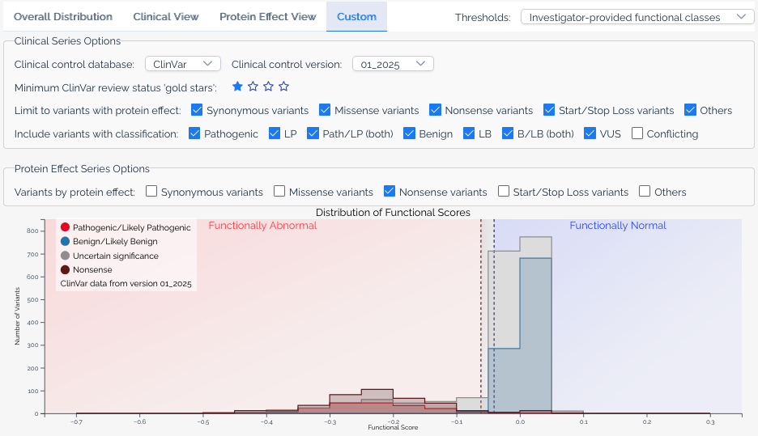

Visualizations
=============================================

.. _visualizations-intro:

MaveDB offers several built-in visualizations to help users explore and interpret variant effect data. These visualizations are automatically generated for published score sets and displayed 
prominently on the score set details page. Users can also download the underlying data used to create these visualizations for further analysis, or download the visualizations themselves 
as image files for use in presentations or publications.

.. _end-visualizations-intro:

Histogram
^^^^^^^^^^^^^^^^^^^^^^^^^^^^^^^^^^^^^

.. _histogram-viz:

The histogram visualization displays the distribution of variant effect scores within a score set. This visualization helps users quickly assess the overall distribution of scores within a dataset. 

Hovering over a bin in the histogram reveals the number of variants that fall within that score range for each series and shows which classification ranges
the bin overlaps when a score calibration is selected. When a variant is selected, the corresponding bin in the histogram is highlighted to show where the variant's score falls within the overall distribution
and the tooltip provides additional information about the selected variant.

.. figure:: images/bard1_base_histogram.png
   :name: base-histogram-example
   :alt: Default histogram visualization from a MaveDB score set page
   :align: left
   
In the example above, we show the base histogram visualization from `urn:mavedb:00001250-a-1 <https://mavedb.org/score-sets/urn:mavedb:00001250-a-1>`_, which describes saturation genome editing of *BARD1*.

When a score set has been linked to :ref:`ClinVar annotations <clinvar-integration>`, the histogram will have a 'clinical view' available. This view overlays the distribution of scores for variants classified as 'Pathogenic' and 'Benign' in ClinVar, allowing users to assess how well the assay segregates known clinical variants.

.. figure:: images/bard1_clinical_histogram.png
   :name: clinical-histogram-example
   :alt: Clinical view of the histogram visualization from a MaveDB score set page
   :align: left

In the example above, we show the clinical view of the histogram visualization from `urn:mavedb:00001250-a-1 <https://mavedb.org/score-sets/urn:mavedb:00001250-a-1>`_, which describes saturation genome editing of *BARD1*.

When a score set includes :ref:`variant effect predictions <vep-integration>`, users may also view a 'protein effect' version of the histogram. This view overlays the distribution of scores for variants predicted to have different effects on the protein, such as 'missense', 'nonsense', and 'synonymous' variants.

.. figure:: images/bard1_protein_effect_histogram.png
   :name: protein-effect-histogram-example
   :alt: Protein effect view of the histogram visualization from a MaveDB score set page
   :align: left

In the example above, we show the protein effect view of the histogram visualization from `urn:mavedb:00001250-a-1 <https://mavedb.org/score-sets/urn:mavedb:00001250-a-1>`_, which describes saturation genome editing of *BARD1*.

To give users more control over the histogram visualization, we also provide a 'custom view' that allows users to adjust the version of ClinVar data used, the 'gold stars' threshold for variant inclusion, include other ClinVar significance categories such as 'Likely pathogenic' and 'Uncertain significance',
limit the series to only variants with specific protien effects, and/or include other series for different protein effects.
When a score set has :ref:`score calibrations <score calibrations>`, users may also overlay functional classifications on the histogram to get a sense of where different classes of variants fall within the score distribution.

   

In the example above, we show a custom view of the histogram visualization from `urn:mavedb:00001250-a-1 <https://mavedb.org/score-sets/urn:mavedb:00001250-a-1>`_, with overlaid score calibrations, variants of unknown significance (via ClinVar) shown in gray, and a series for scores of variants with a predicted 'nonsense' protein effect.

.. _end-histogram-viz:

Heatmap
^^^^^^^^^^^^^^^^^^^^^^^^^^^^^^^^^^^^^

.. _heatmap-viz:

The heatmap visualization provides a two-dimensional representation of variant effect scores across the target sequence. This visualization is particularly useful for identifying patterns of variant effects at specific positions within the gene or protein.
When variants are provided at the nucleotide level, users may toggle between viewing the heatmap at the nucleotide or amino acid level. Amino acids are ordered based
on their hydrophobicity values using the `Kyte-Doolittle scale <http://www.sciencedirect.com/science/article/pii/0022283682905150>`_ and are grouped by chemical class based on values from `Enrich2 <https://genomebiology.biomedcentral.com/articles/10.1186/s13059-017-1272-5/figures/1>`_.

Each cell in the heatmap represents a specific variant at a given position, with the color intensity indicating the variant effect score with wild type variants shown in yellow. Hovering over a cell reveals detailed information about the variant, including its score, classification (if applicable), and the HGVS strings of the variant. Selecting a cell highlights the corresponding variant in other visualizations on the page, such as the histogram.

When a baseline score is available from a :ref:`score calibration <score calibrations>`, the heatmap color scale centers the 'normal' color (purple) at the baseline score to provide better visual contrast for variants with scores deviating from the baseline.

.. figure:: images/msh2_heatmap.png
   :name: heatmap-example
   :alt: Heatmap visualization from a MaveDB score set page
   :align: left

In the example above, we show the heatmap visualization with a selected variant from `urn:mavedb:00000050-a-1 <https://mavedb.org/score-sets/urn:mavedb:00000050-a-1>`_, which describes deep mutational scanning of *MSH2*.
   
.. _end-heatmap-viz:

Protein structure viewer
^^^^^^^^^^^^^^^^^^^^^^^^^^^^^^^^^^^^^

.. _protein-structure-viz:

When a score set is able to be associated with a UniProt accession, MaveDB provides an interactive 3D protein structure viewer using `Mol* <https://molstar.org/>`_ to help users visualize variant effect scores in the context of the protein's structure.

Opening the protein structure viewer displays a side-by-side view of a heatmap and the protein structure for the associated UniProt accession with a color gradient applied based on the mean variant effect score at each position. Users can interact with the 3D structure by rotating, zooming, and selecting specific residues to view their associated variant effect scores and details.
Users may also click and drag on the heatmap to select multiple residues, which will highlight the corresponding regions on the protein structure. Other controls are available in the settings menu on the right side of the viewer, including an option to export the current view as a PNG image.

.. figure:: images/msh2_protein_structure.png
   :name: protein-structure-example
   :alt: Protein structure visualization from a MaveDB score set page
   :align: left

In the example above, we show the protein structure viewer from `urn:mavedb:00000050-a-1 <https://mavedb.org/score-sets/urn:mavedb:00000050-a-1>`_.

.. _end-protein-structure-viz: